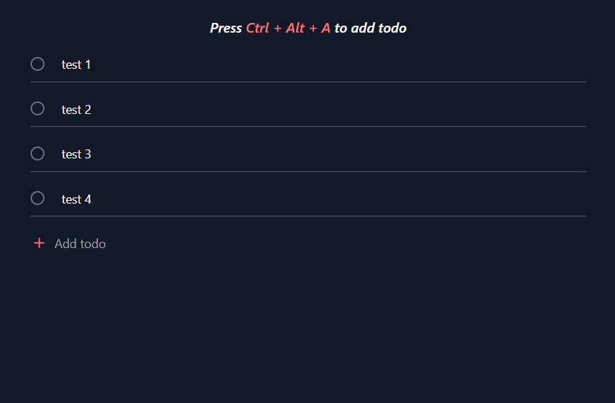

# [Todo](https://todo-violet.vercel.app/)

This is a todo app bootstrapped with the [T3 Stack](https://create.t3.gg/).

[](https://todo-violet.vercel.app/)

## Tech Stack

- [Next.js](https://nextjs.org)
- [NextAuth.js](https://next-auth.js.org)
- [Prisma](https://prisma.io)
- [Tailwind CSS](https://tailwindcss.com)
- [tRPC](https://trpc.io)

## Features

- Authentication with NextAuth.js
- Create, update, and delete todos (authenticated users only)

## Installation

### 1. Clone the repository

```bash
git clone https://github.com/sadmann7/todo.git
```

### 2. Install dependencies

```bash
yarn install
```

### 3. Create a `.env` file

Create a `.env` file in the root directory, and add the environment variables as shown in the `.env.example` file.

### 4. Run the application

```bash
yarn run dev
```

The application will be available at `http://localhost:3000`.

## Deployment

Follow the deployment guides for [Vercel](https://create.t3.gg/en/deployment/vercel), [Netlify](https://create.t3.gg/en/deployment/netlify) and [Docker](https://create.t3.gg/en/deployment/docker) for more information.
